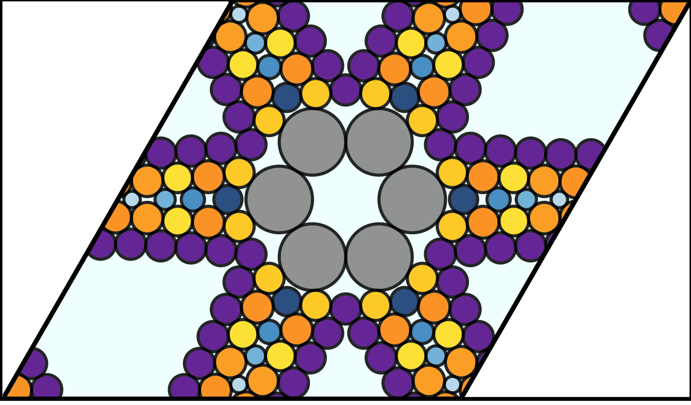



## Overview
Dionysian Packing explores the fundamental limits of rigidity in low-density sphere packings. Traditional high-strength lightweight materials rely on rigid frameworks that balance compressive and tensile forces. However, purely compressive materials such as granular media typically lack a high strength-to-weight ratio.

By analyzing sphere packings where all forces are compressive, we investigate the theoretical limits of creating stable, ultra-low-density configurations. Prior known lowest-density stable packings were formed by diluting crystalline structures, but our research introduces a new construction based on **quasi-one-dimensional rigid structures**. These packings remain mechanically stable even as their density approaches zero.

## Key Findings
- **Lowest Density Rigid Packings**: We demonstrate novel methods to construct mechanically stable packings with densities approaching zero.
- **Rigidity Verification**: Using innovative procedures, we confirm the mechanical stability of these low-density configurations.
- **Material Applications**: These theoretical insights provide a foundation for designing new lightweight, high-strength materials in engineering and materials science.

## Recognition
This research was honored as an "Editors' Choice" article in *Physical Review Letters*, highlighting its significant contribution to the field.

## Research & Publications
This work has been featured in:
- *Physical Review Letters*: [Dionysian Hard Sphere Packings Are Mechanically Stable at Vanishingly Low Densities](https://link.aps.org/doi/10.1103/PhysRevLett.128.018002)
- *arXiv Preprint*: [Dionysian Hard Sphere Packings and the Ideal Glass Transition](https://arxiv.org/abs/2110.07793)

## Visualization
Below is a visualization of Dionysian Packing, illustrating the structural arrangements that enable stability in extremely low-density configurations.

