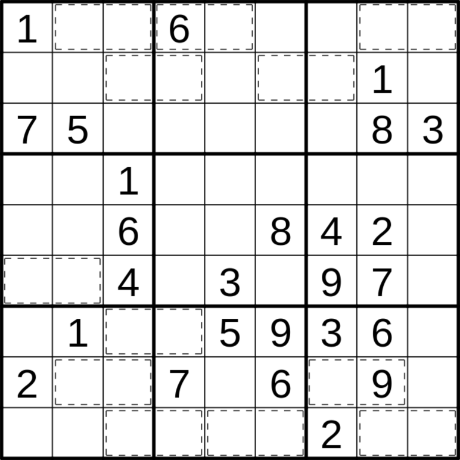

This is an extremely easy coffee break puzzle, so it should be fun way to spend a few minutes.

Ordinary sudoku rules apply. In addition, there are a few cages which once filled can be decoded. Take the two numbers in the cage and subtract 26 as many times as you can (take the caged number modulo 26). The result represents that letter of the english alphabet.

Take for example the number 91. If we subtract 26 from this we get 65, then 39, and finally 13. The thirteenth letter of the english alphabet is m.

Finding the (English) decoded message is necessary to solve the puzzle.

Note: If you don't feel like converting numbers to letters, use this online <a href="https://www.boxentriq.com/code-breaking/numbers-to-letters">tool</a>.

Here is the puzzle. Enjoy! :)

