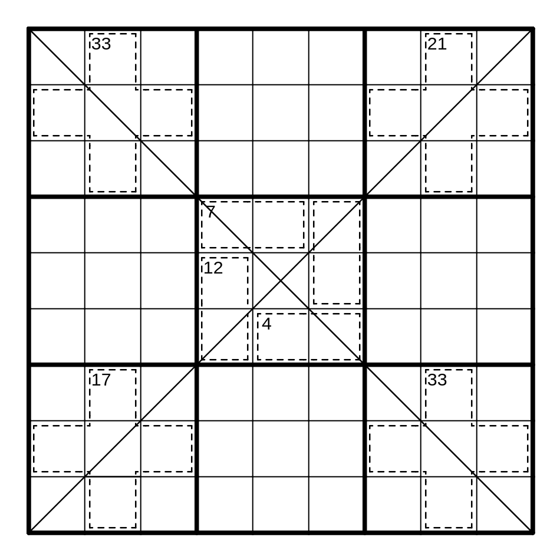

The proper name for this puzzle's constraint probably has something to do with taxicab numbers, but I prefer "long knight." Essentially, this is a knight's move constraint with an extra cell. In the explanation image below, none of the green cells can be a 7.

Ordinary Sudoku Rules Apply

Long Knight Rules Apply

Ordinary Killer Rules Apply

Digits may not repeat along the indicated diagonals.

Here is the puzzle. Enjoy! :)
You can play it <a href="https://git.io/Jt1fs">here</a>.

