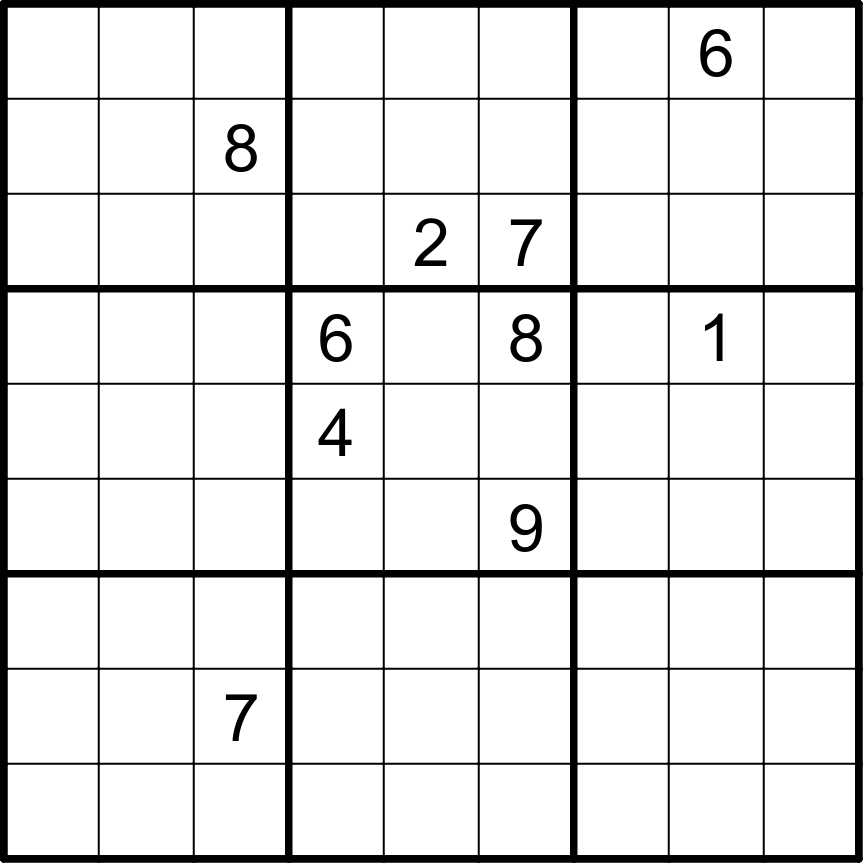

The numbers in this puzzle have a constraint I call anti-princess

Rules:

Ordinary sudoku rules apply. In addition, the number in a box tells you the minimum diagonal distance between another of the same number. In the below example, I have marked the boxes that cannot be 3's in magenta. You'll notice that 1's have no additional constraint and 9's will act like queens. Every other number will behave like something inbetween.

Enjoy!

<strong>The puzzle:</strong>

