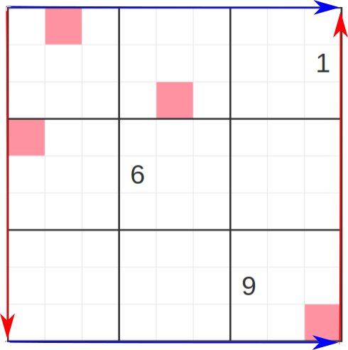

I am making this puzzle for my friend James. It's his birthday! This is the first in a series of puzzles that are played on a Klein Bottle. This is a little bit of an introduction to the concept, but be on the lookout for some really cool variants to come. If you like this idea, please let me know. 

Ordinary sudoku rules apply. In addition, colored squares are the centers of 3x3 magic squares. A magic square is a box that contains the numbers 1 through 9 exactly once and where the rows, columns, and main diagonals all sum to the same number. This puzzle also takes place on a klein bottle. The top and bottom of the grid are glued together--they obey periodic boundary conditions (see the example on the left). The left and right side are twisted and then glued together (see the right side). Let me know if anything is unclear in the comments :)

Here is the puzzle. Enjoy! :)

