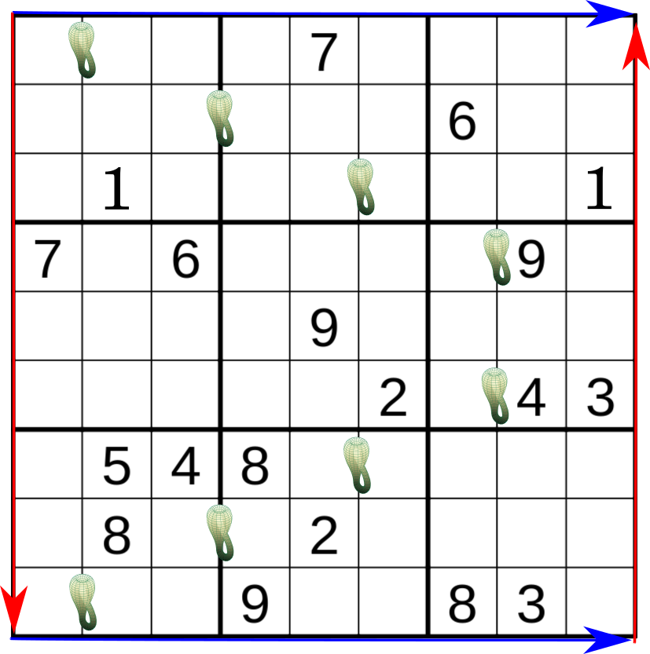

This is the second in a series of puzzles that are played on a Klein Bottle. If you like this idea, please let me know. 

Ordinary sudoku rules DO NOT apply. Please read carefully. This puzzle takes place on a klein bottle. The top and bottom of the grid are glued together--they obey periodic boundary conditions (see the example on the left). The left and right side are twisted and then glued together (see the right side). The little klein bottles denote the separation of two horizontal 9 square "klein rows." Each column and box behave normally. Every column, box, and klein row must contain the digits 1-9 exactly once. You may notice that the 1's in the puzzle are in the same "ordinary row" but they are separated by a klein bottle and are therefore in different klein rows. Let me know if anything is unclear in the comments :)

Here is the puzzle. Enjoy! :)

