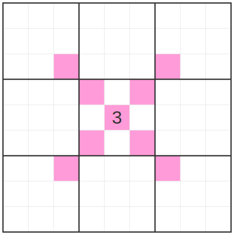

This is a follow up little killer version of my previous puzzle. And my very first puzzle with no given digits!

  

Ordinary sudoku rules apply. In addition, the number in a box tells you the minimum diagonal distance between another of the same number. In the below example, I have marked the boxes that cannot be 3's in magenta. You'll notice that 1's have no additional constraint and 9's will act like queens. Every other number will behave like something inbetween.
In addition, ordinary little killer rules apply: the marked diagonals have the sum shown and digits may repeat in these diagonals.

<a href="https://sudokupad.app/3iugjt2i6m">try it here</a>

