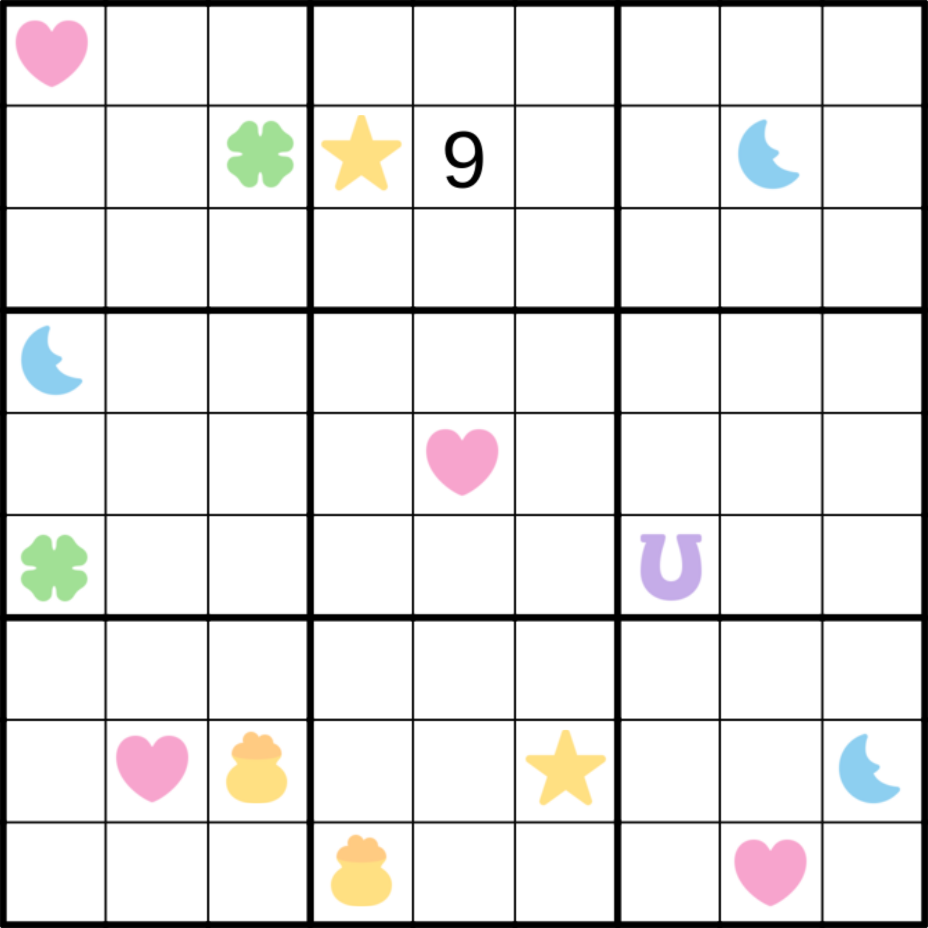

This is the first in what may become a series of puzzles with a constraint I call lucky charms. This is based on one of my all time favorite sugary breakfast cereals from the US. This puzzle is rather easy but I hope that doesn't prevent you from enjoying it because I think you'll find that it has some really neat logic. If you like this variant, please let me know. 

Ordinary sudoku rules apply. In addition, some cells are lucky charms. Each lucky charm symbol represents a different number. The digits near the lucky charm (adjacent and diagonally adjacent) that are within 1 of the lucky charm's number are called close neighbors. For example, if the lucky charm is 4, any neighboring digits that are 3, 4, or 5 are close neighbors. See the example below where these are highlighted. A lucky charm has exactly as many close neighbors as it's number. In the below example, there are two 3's, a 4, and a 5 for a total of 4 close neighbors.

All lucky charms are given (so negative constraints may be necessary).

Here is the puzzle. Enjoy! :)

