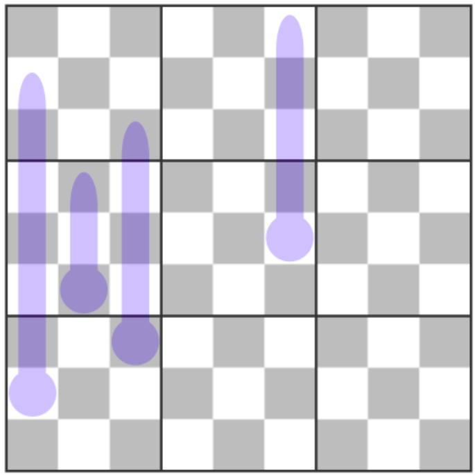

This is the third in a series of puzzles with a constraint I call princesses. If you like this variant, feel free to check out the others. 

Ordinary sudoku rules apply. In addition, the number in a box tells you the minimum diagonal distance between another of the same number. In the below example, I have marked the boxes that cannot be 3's in magenta. You'll notice that 1's have no additional constraint and 9's will act like queens. Every other number will behave like something inbetween.

In addition, thermo-sudoku rules apply: numbers in thermometers must increase starting at the bulb end. It was suggested to me (by RockyRoer) that using the princesses constraint would be slightly nicer if the grid had a light checkerboard pattern. This is for convenience and is not part of the puzzle clues.

Here is the puzzle. Enjoy!

