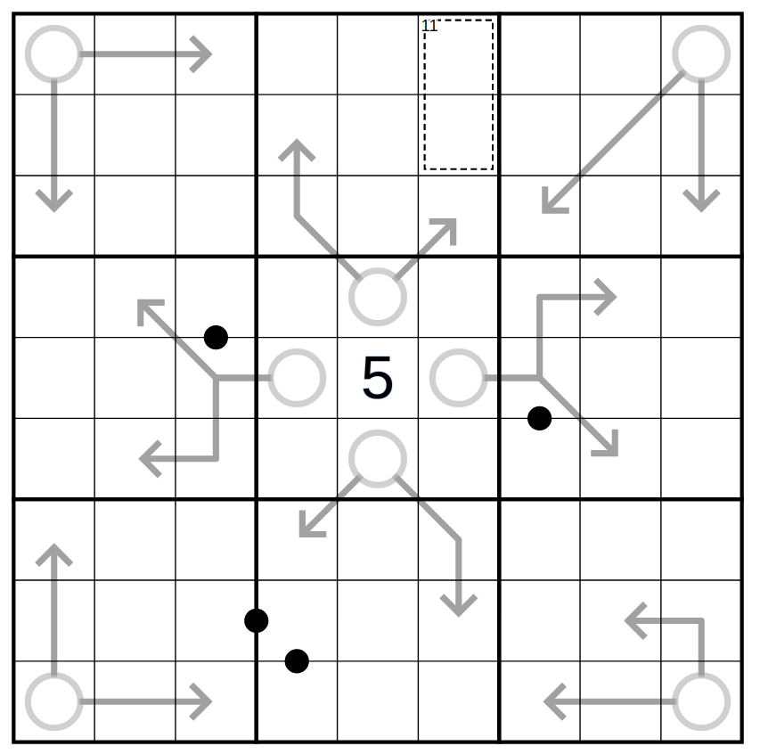

I've had this break-in idea for a while now. This is just a fun little puzzle. Nothing too extreme.

Ordinary Sudoku Rules Apply. Additionally:

1. Arrow rules apply: Digits along an arrow sum to the digit in the arrow's circle.

2. Kropki Rules Apply: Digits separated by a black dot have a ratio of 1 to 2. Not all dots are necessarily given.

3. Killer Rules Apply: Digits in the box sum to 11.

That's it! Enjoy! :)
You can play it <a href="https://tinyurl.com/twofortheshow2">here</a>.

