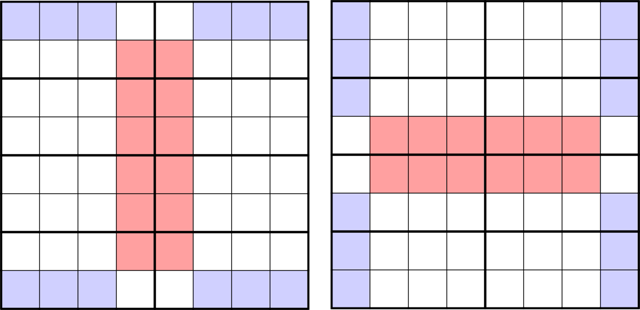

The intention is for you to use the 8x8 version of Phistomefel's theorem. Which, as far as I know, is a novel concept. If you can do that, this puzzle is much simpler. However, it is possible to solve this puzzle without the theorem.
Here is an explanation image:

There are two version of Phistomefel's theorem that show up in this puzzle with non-square regions. In both sides of this image, the red and blue highlighted squares contain the same digits (red=blue). The proof for this follows from the original discovery. If you don't know what I'm talking about, see <a href="http://forum.logic-masters.de/showthread.php?tid=1811">here</a>.
Rules:

-Ordinary sudoku rules apply.

-Killer Sudoku Rules apply. Digits cannot repeat in cages and must sum to the number in the top left (if given).

<a href="https://swaroopg92.github.io/penpa-edit/?m=solve&p=vZZBr+Q0EITv71c85exD7Dix+11hOSEOLAih0RPiwA8AxGWedn/7fm13ZTJ/AI0mU5XY1dV2JZN///7vz3/+Sp3P1tOaMp+tlvEtq43vOj8vtwDvL7clL2kpfPPy/vX++ettWVJ+f/m4//z2cf/j7fb+Jd1/fcDPbx8cfxrH/PaxHL0ub7dl90lpaevqrAUr/XqtjmuvuYuPq695Db4fzo9gfVwNpT6VXgtmB59aodylFHOtXF3YnGvBtjLH6uqcGyyvc2oI53UbnsZVGv59tP3DOJZx/IVVSfdtHL8fx3Uc93H8cYz5xDLlznZ0ShdUewFvgTcwSzhwBe+BdzDFB25gbA7cwRb4ALeJD/RbaDbXvOhYjLHmIRh4BILVHLjkVLY5l99U6pzLbyr7nFsK4zfWZoxZwTF387mzL36fdbbZF7/g0NzQ9EUd+ACHfmZujrkZzRyamVo5arln0jJxv/Tifc31KSuaa2iu1Fq9Fpvw29iK72Zi0+FLizTkgDB+kpYOo8AgtkKoPK/YlXTmUHuSHULxSVyaTp1wL6S20sYkBUJ/k2yQcACAhIOG5QupkFMtQ1jQh3TY4S5LzbdmEPamNUk3pFt4A0DCdWvtQthDTkjNULtKFw2rSFf1w0OlVfVT6aeqaKWoaZgxzOTa6MfUjzHnJBU7dqqxBlV2KnM8j5NgtEpt2JHRitFda7BzxWTH3I7WwBhm6ofb4UF2pP0+mWqswX6Vrucw1Hap7TxrtSUASBQFQEKts6cnabtB1M+Og/1JWsOIWFMSAan7PTPUuGn6Fg4AkBDoW3uQZhlyqtGP0jukld7Obdr91pyEFh7EBdScEyUEAJEAqboQvClvnSRyIghB4sSFKFUArkRcAJDIAc/41JU3AOS8gmvlrZOQroR0EsKJq0C0zXiIWiBiF4IdZQeQurLTyeiF4EAZnUR1yHVXlAEQrQF564pYJ28PQsS6IjYcKGKcZZi8dez438YkFPX/jUnwpqcYAHLOwcGD4E1PpM6fECeu0nJAKLryBkimvAEg0Q8AEkaNvJ2kkzdOSI3mlLchrbzxz5ysRD+AZIekD6RbOABAQsAOu5CyMedUo2iJBZnS5zA3KjWSaEoiAKKipNeUXiPXD0LiOSE1HOiZOKSVXt4muBIrCkjWVZTlNe0cACKj7Jxp5wAQ1WHnLsTVYueMneOE6vgw2eEO5sTVjuqQKlOuAckUZQBEa0BGTbE0MvogJJETUmMNFNghrcD6O1PiEL06chouHDmN0iBectYShjU3dH2c06jp454pLzkIiBJNDtGHI6enq82gen44cnq64kHxRN2GnhXM5Y2Lc8+Fhg1eIiqvEl9eXm7u9emD2f+Tv38D&a=RZFbCoRADATvst/5mDwfZ5G9/zVWu4UFoRjTqUz0ur7yfz56juRHbqoUaBKgi4MhA6boQz08qzKn9r5/8xr0aNKrJQa29E0ropG2QdEWLudVnDdxit0xz4enRSQOIqGohUEWDlkEJkTCmYdQtCeT6bAkk5mwZMGZDUsZTsXpxWQlawVZNdQ1kNVC3UEk2rvQ3o2G5ra9kA1vNor2KYLTZ1hjcvnJlzssd1jHhKVzn+TzS78/">try it here</a>
